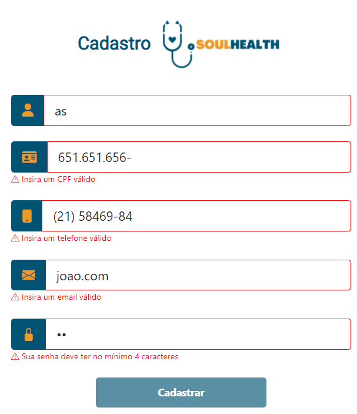

# Como se cadastrar no Soul Health

- Acesse o Soul Health e clique no botão cadastro
- Preencha os campos com nome, cpf, telefone email e senha
- Clique em cadastrar 

## Possíveis erros ao tentar se cadastrar

- Nome com menos de 3 caracteres
- CPF inválido com menos de 11 números
- Número de telefone inválido com menos de 11 números
- Email inválido por falte de provedor
- Campo de senha inválido com menos de 4 caracteres
- Preencher todos os campos corretamente é condição para que o botão de cadastrar se torne clicavel

# Padrão de codificação
- códigos sem o uso de ponto e vírgula
- nomes de variáveis em inglês

### Arquivo signup.component.ts
- Serviço `SignupService`: serviço responsável por enviar os dados de cadastro ao endpoint através `método HTTP POST`.
- Variável `User`: variável do tipo Signup que é responsável por armazenar as informações inseridas em cada input pelo usuário
- Método `onSubmit()`: responsável por enviar as informações armazenadas em `user` para o endpoint especificado no serviço `SignupService`. Após o envio das informções o usuário será redirecionado para a view de login.

### Arquivo signup.service.ts
- Variável `url`: variável responsável por armazenar parte do endpoint que será utilizado para o envio dos dados.
- Variável `http`: criada dentro do constructor da classe para instanciar os métodos https.
- Método `signUp(user:Signup)`: responsável por enviar as informações armazenadas no parametro `user` para o endpoint especificado no método `http.post<Signup>()`

### Arquivo signup.ts
- ``Interface`` responsável por padronizar os dados que serão enviados ao backEnd
- Através dessa interface é tipada a variável `user` de signup.component.ts, o parametro do método `signUp(user:Signup)` localizado em signup.service.ts e o método `http.post<Signup>()` sendo tipado com o operador diamante`<>`.
## 🛠️ Construído com

- [Angular](https://angular.io/)
- [Bootstrap](https://getbootstrap.com/docs/5.1/getting-started/introduction/)
- [TypeScript](https://www.typescriptlang.org/)

## 📌 Versão

Nós usamos o GitHub para controle de versão.

## ✒️ Autores

- **Bruno Gomes** - (https://github.com/BrunodevOliveira)
- **Camila Silva** - (https://github.com/CamiMSilva)
- **Jaqueline Rodrigues** - (https://github.com/agorasoudev)
- **Lucélia Batista** - (https://github.com/Luceliabatista)
- **Silas Sousa** - (https://github.com/SilasSousadeJesus)
