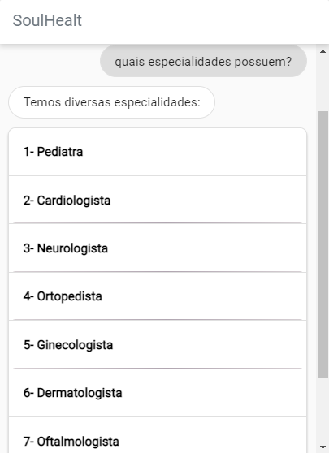
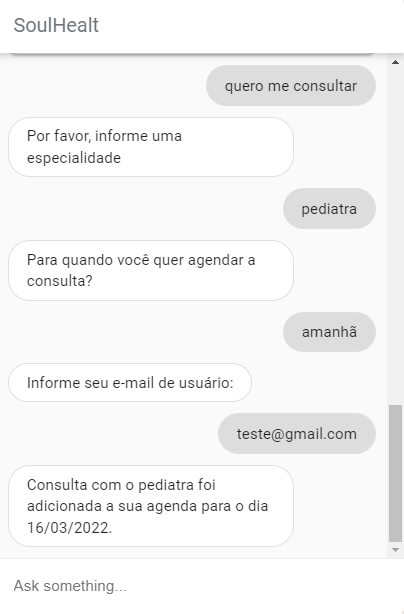
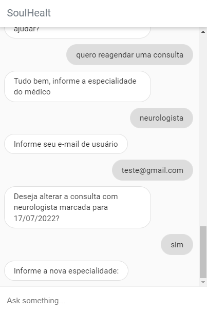
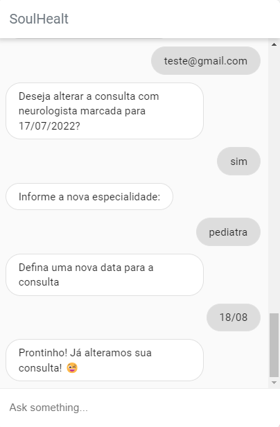
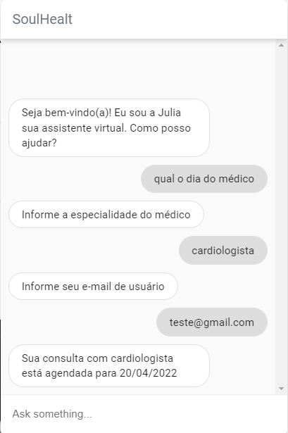
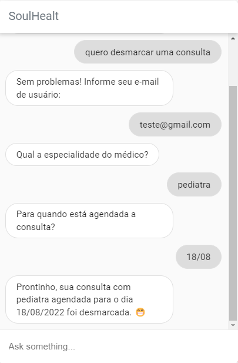
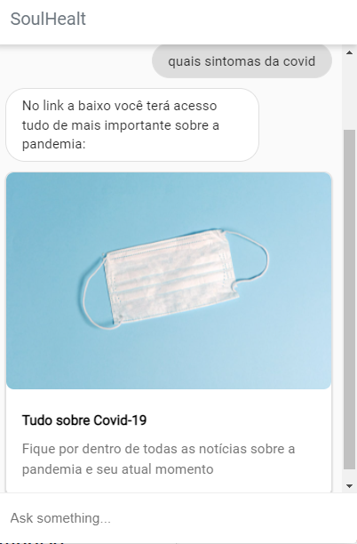
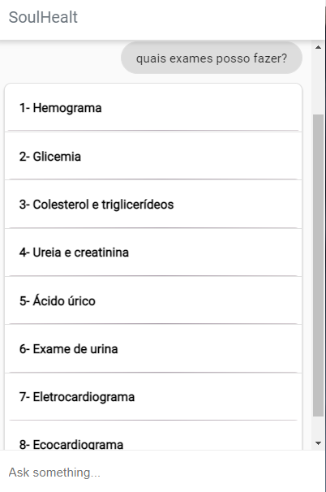

# Interação com chat bot
Com o chat bot podemos podemos obter informações sobre horário de funcionamento, clínicas e agendar uma consulta

## Especialidades e horário de funcionamento
- Para descobrir quais especialidades médicas a Soul Health possui basta iniciar uma pergunta com:
  - Quais especialidades possuem
  - Quais médicos possuem 
  - Quero marcar uma consulta
  

    
  

   
## Agendamento de consulta
- Após decidir com qual especialidade deseja agendar uma consulta, basta proseguir a interação com uma dessas frases:
  - quero me consultar
  - quero marcar uma consulta
  - quero agendar uma consulta
### Informações necessárias para o agendamento
- Interagindo com uma das frases acima (ou alguma parecida com essas) o chat bot irá pedir alguns dados para efetuar o agendamento:
  - Especialidade com a qual deseja agendar uma consulta
  - Data do agendamento
  - Email de usuário
- Após informar esses 3 dados, receberá uma mensagem de confimarção da consulta e poderá edita-la na aba Meus agendamentos
  

    
  

   
## Atualizar consulta
- Para atualizar uma consulta pode-se utilizar as seguintes interações:
  - Reagendar consulta 
  - trocar data da consulta
  - adiar consulta
  - trocar especialidade
  - remarcar consulta
### Informações necessárias para a atualização
- Após o pedido do usuário para atualizar a consulta através de uma das interações citadas, o chat bot irá pedir alguns dados:
  - Especialidade do médico
  - Email de usuário
  

    
  

   
### Novos dados
- Após informar a consulta que deseja alterar e o email de usuário, o chat bot irá pedir os novos dados:
 - Nova especialidade do médico
 - Nova data para agendamento
  

    
  

   

## Pesquisar consulta
- Para pesquisar uma consulta pode-se utilizar as seguintes interações:
  - pesquisar consulta
  - qual o dia do médico
  - quando marquei o médico
  - qual o dia da consulta
  - quando marquei a consulta
  - para quando agendei a consulta
### Informações necessárias para exibir o resultado da pesquisa
- Após o pedido do usuário para pesquisar a consulta através de uma das interações citadas, o chat bot irá pedir alguns dados:
  - Especialidade do médico
  - Email de usuário
- Em seguida será exibido a consulta mais recente a gendada para a especialidade informada.
  

    
  

   

## Cancelar consulta
- Para cancelar uma consulta pode-se utilizar as seguintes interações:
  - deletar consulta
  - excluir consulta
  - desmarcar consulta
  - cancelar consulta
### Informações necessárias para cancelar uma consulta
- Após o pedido do usuário para cancelar uma consulta através de uma das interações citadas, o chat bot irá pedir alguns dados:
  - Email de usuário
  - Especialidade do médico
  - Data de agendamento
- Em seguida será exibida a mensagem confirmando o cancelamento da consulta.
  

    
  

   

## FAQ
-  Respostas sobre as dúvidas mais comuns dos clientes

### Covid
- Informações úteis sobre prevenções e estatísticas da pandemia no Brasil
- As frases de interações mais frequentes são:
  - quais sintomas da covid
  - covid tratamento
  - como se cuidar contra covid

  

      
  
 
   
### Exames
- Informações sobre os exames que o plano irá cobrir
- As frases de interações mais frequentes são:
  - Quais exames tenho direito
  - Posso fazer exames
  - Quais exames posso fazer
  

    
  
 
   

### Localização
- Informações sobre os pontos de atendimento e cobertura do plano
- As frases de interações mais frequentes são:
  - Qual horário de funcionamento
  - Onde me consultar
  - Qual o endereço da clínica
  

      
  
 
   
## 🛠️ Construído com

- [Angular](https://angular.io/)
- [Bootstrap](https://getbootstrap.com/docs/5.1/getting-started/introduction/)
- [TypeScript](https://www.typescriptlang.org/)

## 📌 Versão

Nós usamos o GitHub para controle de versão.

## ✒️ Autores

- **Bruno Gomes** - (https://github.com/BrunodevOliveira)
- **Camila Silva** - (https://github.com/CamiMSilva)
- **Jaqueline Rodrigues** - (https://github.com/agorasoudev)
- **Lucélia Batista** - (https://github.com/Luceliabatista)
- **Silas Sousa** - (https://github.com/SilasSousadeJesus)
