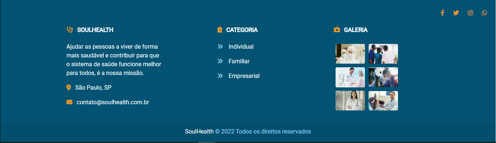

# Footer

Componente alocado no rodapé da aplicação contendo informações sobre o autor da seção de dados, direitos autorais ou links para documentos relacionados.

## 🚀 Começando

Essas instruções permitirão que você obtenha uma cópia do projeto em operação na sua máquina local para fins de desenvolvimento e teste.

### 🔧 Instalação

Instalações dos pacotes descritos no <a href="/README.md">README.MD</a> do projeto.

## 📦 Desenvolvimento

  

        o Footer foi construido com Boostrap e sua estilização foi complementada com o uso de SASS, desta forma foi possivel estilizar e dar responsividade a todo o componente. o Footer se comunica com todos os outros componentes atraves da sua articulação com o Shared-modulo, que é um modulo compartilhado com o footer e o navbar e importado para o app.module. como ele é mantido no app.module.ts e no app.componente.html (atraves do sue seletor) então, esse componente fica fixo em todas as outras views, assim como o navbar.
  

   

## 🛠️ Construído com

- [Angular](https://angular.io/)
- [Bootstrap](https://getbootstrap.com/docs/5.1/getting-started/introduction/)
- [TypeScript](https://www.typescriptlang.org/)

## 📌 Versão

Nós usamos o GitHub para controle de versão.

## ✒️ Autores

- **Bruno Gomes** - (https://github.com/BrunodevOliveira)
- **Camila Silva** - (https://github.com/CamiMSilva)
- **Jaqueline Rodrigues** - (https://github.com/agorasoudev)
- **Lucélia Batista** - (https://github.com/Luceliabatista)
- **Silas Sousa** - (https://github.com/SilasSousadeJesus)
