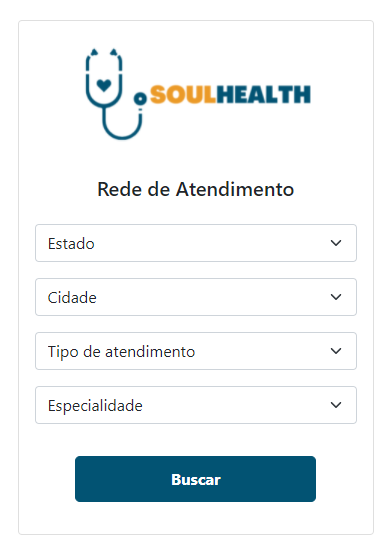
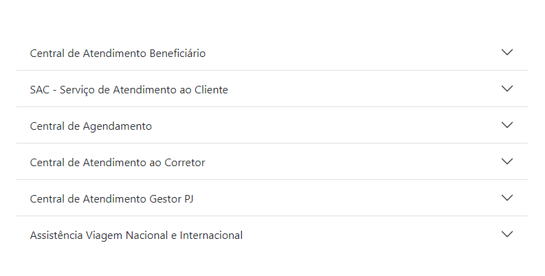

# Página Home da Aplicação

A página Home é o primeiro contato do usuário com a aplicação do plano médico SoulHealth. Dessa forma, ela atende tanto o usuário que já é associado ao plano, direcionando-o ao login, quanto o usuário que quer saber mais sobre o plano.

## 🚀 Começando

Essas instruções permitirão que você obtenha uma cópia do projeto em operação na sua máquina local para fins de desenvolvimento e teste.

### 📋 Pré-requisitos

Não há.

### 🔧 Instalação

Instalações dos pacotes descritos no <a href="/README.md">README.MD</a> do projeto.

## 📦 Desenvolvimento

### Jumbotron

No topo da tela, o usuário se depara com um jumbotron ou hero, recurso comumente usado para chamar a atenção do usuário para o produto e que contém um "chamado à ação". No caso da home SoulHealth, o jumbotron é uma div container de Bootstrap que contém uma imagem de fundo retratando uma equipe médica e dois botões, um que direcionam o usuário associado ao login e todas as funcionalidades online do plano médico, e o outro que direciona o não-associado a se cadastrar.

 

### Agência Virtual

A agência virtual é a seção da home que visa facilitar o acesso do cliente associado aos recursos mais rotineiros do plano, como 2ª via de boleto, pesquisa de rede de atendimento, etc. Esses recursos estão dispostos em cards com ícones que fazem referência ao serviço e link para ele.
 

Importante ressaltar que, caso o usuário não esteja logado, ele não conseguirá acessar essas rotas, mas será antes redirecionado ao login.

 

### Rede de atendimento

Trata-se da seção onde o usuário poderá fazer a busca da rede credenciada ao plano. Foi desenvolvida em um container com classe card que contém um formulário com diversos inputs do tipo select, nos quais o usuário poderá filtrar características do atendimento que deseja buscar, como localização, especialidade, etc.

 

### Notícias

Nessa seção, o usuário tem acesso a algumas notícias da área médica. Elas são apresentadas no formato de carrossel (slideshow), sendo que cada uma contém título e subtítulo, controle de avançar e retroceder e indicadores de posição no carrossel.

 

### Contatos

Aqui o usuário tem acesso aos canais de contato do SoulHealth. Essa seção foi desenvolvida como um menu acordeão, sendo constituído por guias que abrem e fecham ao clique do mouse. A intenção é que elas iniciem todas fechadas e o usuário abra apenas a que satisfaz sua necessidade, visando não poluir a visualização e facilitar o entendimento da informação.

 

## 🛠️ Construído com

- [Angular](https://angular.io/)
- [Bootstrap](https://getbootstrap.com/docs/5.1/getting-started/introduction/)
- [TypeScript](https://www.typescriptlang.org/)

## 📌 Versão

Nós usamos o GitHub (https://github.com/) para controle de versão.

## ✒️ Autores

- **Bruno Gomes** - (https://github.com/BrunodevOliveira)
- **Camila Silva** - (https://github.com/CamiMSilva)
- **Jaqueline Rodrigues** - (https://github.com/agorasoudev)
- **Lucélia Batista** - (https://github.com/Luceliabatista)
- **Silas Sousa** - (https://github.com/SilasSousadeJesus)
