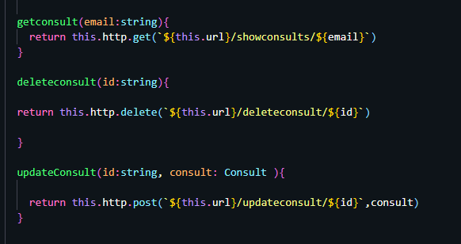
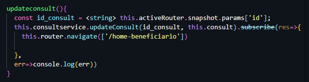

# Como acessar página Meus Agendamentos

- Acesse a aplicação Soul Health.
- Clique em entrar e informe seus dados de usuário.
- Ou, se já estiver logado mas acessando outra página, clique no botão `minha página` localizado no canto superior direito.
- Em seguida acesse a aba "Meus Agendamentos"

- A tela exibida mostrará as consultas já agendadas, se existirem, e exibirá os botões de "Alterar" e de "Excluir", permitindo assim que o beneficiário possa administrar seus agendamentos.

 

 
  

### 📋 Atualizar

- Ao clicar no botão **Alterar**, o usuário sera redirecionado para a página onde os dados poderão ser editados.
- Após a edição dos dados, basta clicar no botão **Reagendar** para que os novos dados sejam salvos ou em **cancelar** para permanecer com os atuais.

    
     

### 🗑️ Excluir

- Ao clicar no botão **Excluir**, a consulta agendada será excluída, sem necessitar de confirmação.

## 📦 Desenvolvimento

Para realizar as ações descritas acima foram desenvolvidos os seguintes códigos:

- Serviço ConsultService
  - Responsável pela comunicação entre o front end da aplicação e sua API.
  - Através dele foi desenvolvido a forma de envio e recebimento de dados.
  - A depender da ação que o usuário queira realizar, será executado um dos seguintes métodos:
    - `getconsult(email:string)`→ Envia o email através do método `GET` e obtém como resposta os dados do agendamento do usuário referente ao email enviado.
    - `updateConsult(id:string, consult: Consult )`→ Envia o Id da consulta do usuário e os dados que serão atualizados através do método `POST`, obtendo como resposta os dados do agendamento do usuário atualizados.
    - `deleteconsult(id:string)`→ Envia o Id da consulta do usuário através do método `GET`, e a consulta é excluída do banco de dados.
    

      
    
 
       
- Componente homeUser

  - Responsável por capturar a interação do usuário e envia-la por meio do serviço beneficiary-service

    - `updateconsult()`→ Identifica o a consulta do usuário através do ID e envia os dados atualizados que são armazenados na variável `consult`.

  

    
  
 
     

### Padrão de codificação

- códigos sem o uso de ponto e vírgula
- nomes de variáveis em inglês

## 🛠️ Construído com

- [Angular](https://angular.io/)
- [Bootstrap](https://getbootstrap.com/docs/5.1/getting-started/introduction/)
- [TypeScript](https://www.typescriptlang.org/)

## 📌 Versão

Nós usamos o GitHub para controle de versão.

## ✒️ Autores

- **Bruno Gomes** - (https://github.com/BrunodevOliveira)
- **Camila Silva** - (https://github.com/CamiMSilva)
- **Jaqueline Rodrigues** - (https://github.com/agorasoudev)
- **Lucélia Batista** - (https://github.com/Luceliabatista)
- **Silas Sousa** - (https://github.com/SilasSousadeJesus)
