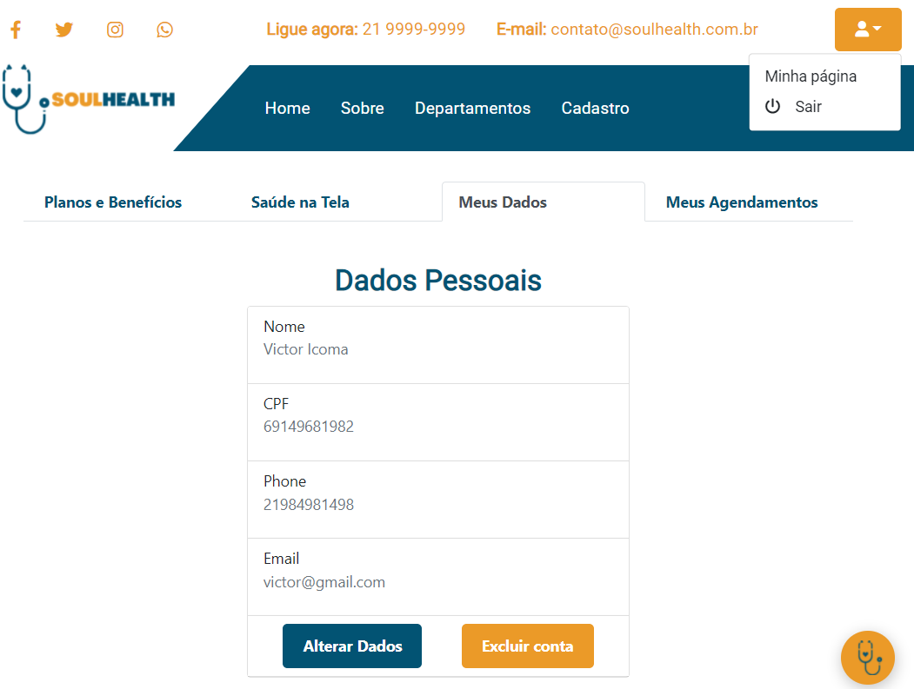
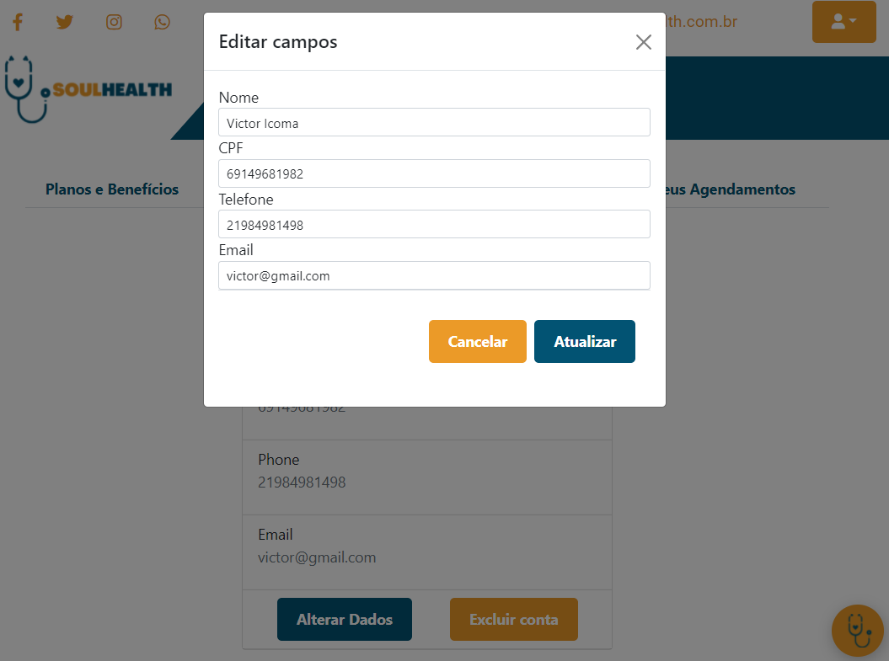
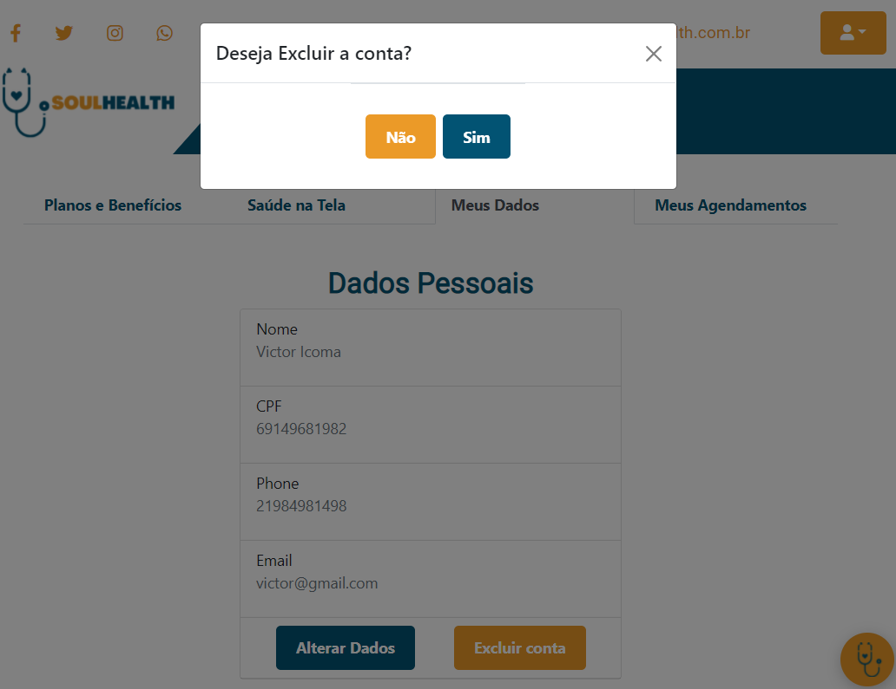
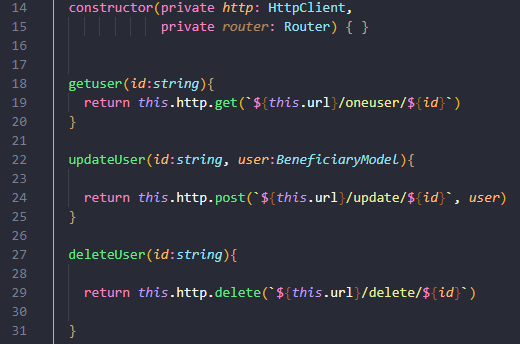
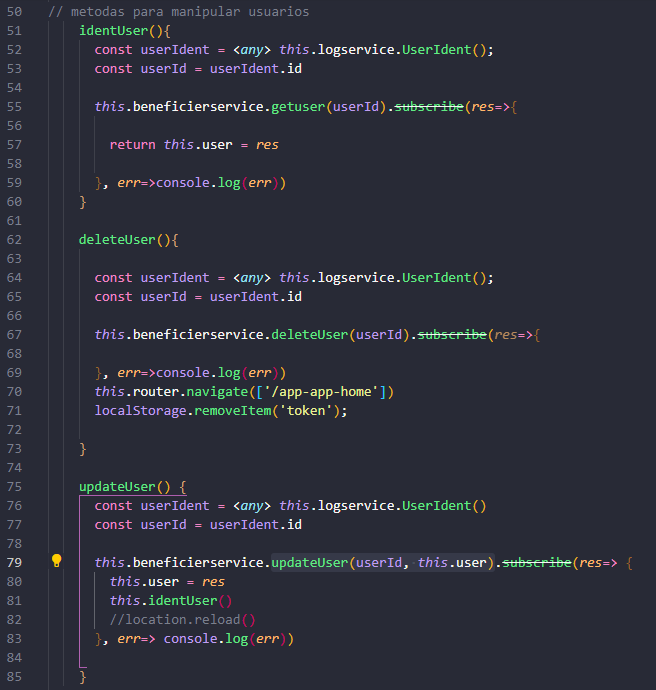

# Como acessar página Meus Dados
- Acesse a aplicação Soul Health
- Clique em entrar e informe seus dados de usuário
- Ou, se já estiver logado mas acessando outra página, clique no botão `minha página` localizado no canto superior direito
- Em seguida acesse a aba Meus dados

  

      
  
 
     

## Dados pessoais
- Tabela que exibe todos os dados informados pelo usuário no momento de cadastro
- A partir desta tabela é possível atualizar os dados cadastrais ou excluir conta

### 📋 Alterar dados
- Ao clicar no botão **Alterar Dados**, será exibido um modal com os dados atuais do usuário
- Esses dados estarão em um campo para edição onde ousuário poderá editá-los
- Após a edição dos dados, basta clicar no botão **Atualizar** para que os novos dados sejam salvos ou em **cancelar** para permanecer com os atuais.
  

    
  
 
     

### 🗑️ Excluir conta
- Ao clicar no botão **Excluir Conta**, será exibido um modal de confirmação
- Confirmando a ação sua conta será excluída e o usuário será redirecionado para a Home
  

    
  
 
     

## 📦 Desenvolvimento
Para realizar as ações descritas acima foram desenvolvidos os seguintes códigos:

- Serviço beneficiary-service
  - Responsável pela comunicação entre o front end da aplicação e sua API.
  - Através dele foi desenvolvido a forma de envio e recebimento de dados.
  - A depender da ação que o usuário queira realizar será executado um dos seguintes métodos: 
    - `getuser(id:string)`→ Envia o Id do usuário através do método `GET` e obtém como resposta os dados do usuário referente ao ID enviado
    - `updateUser(id:string, user:BeneficiaryModel)`→ Envia o Id do usuário e os dados que serão atualizados através do método `POST`, obtendo como resposta os dados do usuário atualizados 
    - `deleteUser(id:string)`→ Envia o Id do usuário através do método `GET`, após efetuada a exclusão o usuário será redirecionado para Home da aplicação.
  

    
  
 
     
- Componente homeUser
  - Responsável por capturar a interação do usuário e envia-la por meio do serviço beneficiary-service
  - A depender da ação que o usuário queira realizar será executado um dos seguintes métodos: 
    - `identUser()`→ Identifica o usuário através de seu ID e popula a tabela **dados pessoais** armazenando os dados na variável `user`.
    - `deleteUser()`→ Identifica o usuário através de seu ID e o exclui, redirecionando o usuário para a home page da aplicação.
    - `updateUser()`→ Identifica o usuário através de seu ID e envia os dados atualizados que são armazenados na variável `user` seguido do ID através do método que se encontra em **beneficiary-service** chamado `updateUser(userId, user)`.

  

    
  
 
     
### Padrão de codificação
- códigos sem o uso de ponto e vírgula
- nomes de variáveis em inglês

## 🛠️ Construído com

- [Angular](https://angular.io/)
- [Bootstrap](https://getbootstrap.com/docs/5.1/getting-started/introduction/)
- [TypeScript](https://www.typescriptlang.org/)

## 📌 Versão

Nós usamos o GitHub para controle de versão.

## ✒️ Autores

- **Bruno Gomes** - (https://github.com/BrunodevOliveira)
- **Camila Silva** - (https://github.com/CamiMSilva)
- **Jaqueline Rodrigues** - (https://github.com/agorasoudev)
- **Lucélia Batista** - (https://github.com/Luceliabatista)
- **Silas Sousa** - (https://github.com/SilasSousadeJesus)
