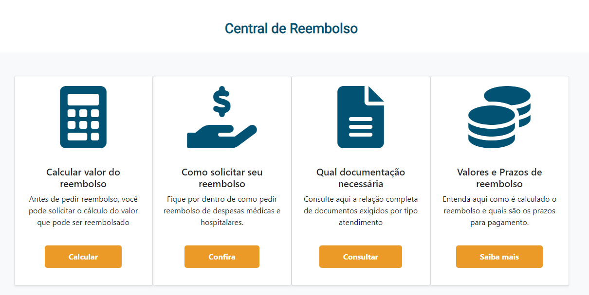
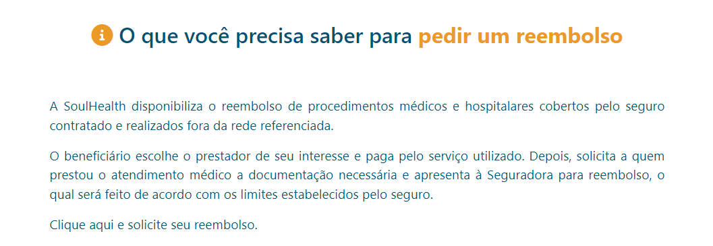
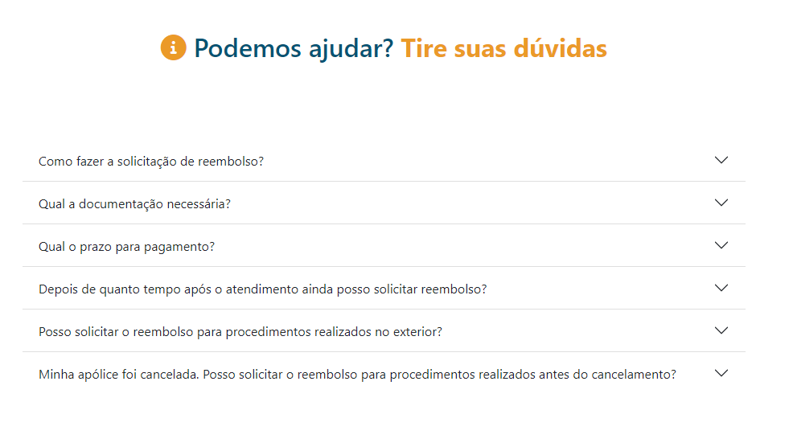

# Página de informações de Reembolso

A página reembolso é onde o usuário associado encontrará instruções e recursos para solicitar reembolsos cobertos pelo plano.

## 🚀 Começando

Essas instruções permitirão que você obtenha uma cópia do projeto em operação na sua máquina local para fins de desenvolvimento e teste.

### 📋 Pré-requisitos

Para acessar esta página na aplicação, o usuário precisará estar com seu login autenticado.

### 🔧 Instalação

Instalações dos pacotes descritos no <a href="/README.md">README.MD</a> do projeto.

## 📦 Desenvolvimento

### Central de reembolso

Nessa seção, há quatro cards dentro de um container e através destes o usuário tem acesso aos principais serviços e informações relacionados aos reembolsos cobertos pelo plano de saúde.
 

### Resumo

Nessa seção, em formato de texto em parágrafos, faz-se um resumo do que é o reembolso e qual é o procedimento adotado pelo SoulHealth para que o usuário usufrua dele.
 

### Dúvidas

Nessa seção, o usuário tem as repostas às dúvidas mais frequentes relacionadas à reembolso. A seção foi desenvolvida em formato de menu acordeão que abre apenas a guia clicada, gerando uma visualização mais limpa.
 

## 🛠️ Construído com

- [Angular](https://angular.io/)
- [Bootstrap](https://getbootstrap.com/docs/5.1/getting-started/introduction/)
- [TypeScript](https://www.typescriptlang.org/)

## 📌 Versão

Nós usamos o GitHub (https://github.com/) para controle de versão. 

## ✒️ Autores

- **Bruno Gomes** - (https://github.com/BrunodevOliveira)
- **Camila Silva** - (https://github.com/CamiMSilva)
- **Jaqueline Rodrigues** - (https://github.com/agorasoudev)
- **Lucélia Batista** - (https://github.com/Luceliabatista)
- **Silas Sousa** - (https://github.com/SilasSousadeJesus)
